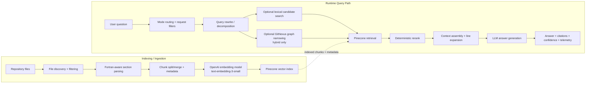

# RAG Architecture

This document shows the complete Retrieval-Augmented Generation flow used for code understanding in `National-Seismic-Hazard-Maps`.

Scope note:
- This covers the RAG pipeline used for repository question answering and evidence-backed retrieval.
- `Run Audit` and `Diagrams` are not in this path; they use a separate direct repo-scan + LLM flow.

## End-to-End Flow

## How It Works

### 1. Ingestion

- The system scans the repository and keeps supported source/config files.
- Fortran files are parsed into structure-aware sections such as `program`, `subroutine`, `function`, and `module`.
- Large sections are split into bounded chunks and small chunks may be merged.
- Each chunk keeps metadata such as file path, line range, symbol name, symbol type, and module context.
- Chunks are embedded with `text-embedding-3-small` and stored in Pinecone.

Why this matters:
- Chunk boundaries align to real code structure instead of arbitrary windows.
- Metadata makes file-grounded citations and reranking more reliable.

### 2. Query Intake

- A user submits a code question from the UI.
- The backend normalizes mode, scope, repo, and file filters.
- The question is rewritten into focused subqueries when needed.

Typical examples:
- exact identifier lookup
- call chain tracing
- dependency questions
- conceptual code explanation

### 3. Candidate Retrieval

- For identifier-heavy questions, the backend can run lexical search first to find exact token hits and likely files.
- In hybrid mode, GitNexus can narrow the candidate file set using graph/context/impact signals.
- The rewritten query or subqueries are embedded and sent to Pinecone.
- Pinecone returns semantically similar chunks plus usage metrics.

### 4. Reranking

- Retrieved chunks are reranked using a deterministic scoring layer.
- The rerank stage combines:
  - semantic similarity
  - exact identifier matches
  - token overlap
  - symbol and module boosts
  - lexical file boosts
  - small penalties for low-signal chunks

Why this matters:
- Pure vector retrieval is not enough for legacy code.
- Deterministic reranking improves precision for exact routine and file questions.

### 5. Context Assembly

- The top chunks are expanded to nearby lines.
- When possible, the backend expands to enclosing routine or module context.
- The final prompt context is assembled from the best evidence only.

Result:
- the LLM sees enough local code context to explain behavior
- the user gets file paths and line-grounded citations

### 6. Answer Generation

- The LLM generates the final answer from the selected context.
- The response includes citations, evidence metadata, and telemetry.
- Confidence is intentionally conservative when evidence coverage is weak or the requested identifier is missing.

## Telemetry and Cost Tracking

Each request records:

- embedding latency
- Pinecone latency and read units
- rerank latency
- LLM latency
- postprocess latency
- total latency
- embedding, Pinecone, rerank, and LLM estimated cost

This supports:
- request-level debugging
- cost analysis
- latency analysis
- summary endpoints for recent requests

## Key Design Choices

- **Pinecone for vector retrieval:** managed search, metadata filtering, and usage metrics.
- **Fortran-aware chunking:** better alignment with legacy scientific code structure.
- **Deterministic rerank:** improves exact-match retrieval quality.
- **Context expansion at retrieval time:** reduces the need for overlapping chunks while keeping cost lower.

## Current Limits

- The system is strongest on Fortran, not COBOL.
- Broad conceptual questions can still retrieve noisy evidence.
- Missing focus terms can cause intentionally low confidence.
- Hybrid quality depends on GitNexus availability.
- Current production telemetry is not durable until it is moved from SQLite fallback to Postgres.
