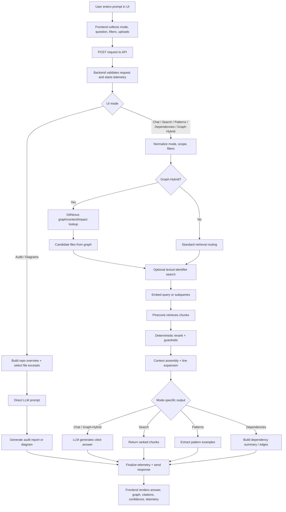

# RAG Data Flow

This document shows the end-to-end request path for the RAG-backed modes in LegacyLens.

## What Happens

1. The user submits a prompt from the UI with a mode, filters, and optional uploads.
2. The backend validates the request and starts request-scoped telemetry.
3. For Graph/Hybrid, the graph layer first narrows the search to likely files, symbols, and dependencies.
4. The query is embedded with OpenAI and searched against Pinecone for relevant code chunks.
5. Retrieved chunks are reranked, expanded to line context, and assembled into the final prompt context.
6. The LLM generates the answer, and the API returns the response with citations, confidence, and telemetry.

## Mermaid Chart

## Key Distinction

- Graph/Hybrid is graph-guided RAG: graph narrows the search, and RAG supplies the line-level evidence.
- Audit and Diagrams are direct LLM modes and do not run through the Pinecone retrieval pipeline.
